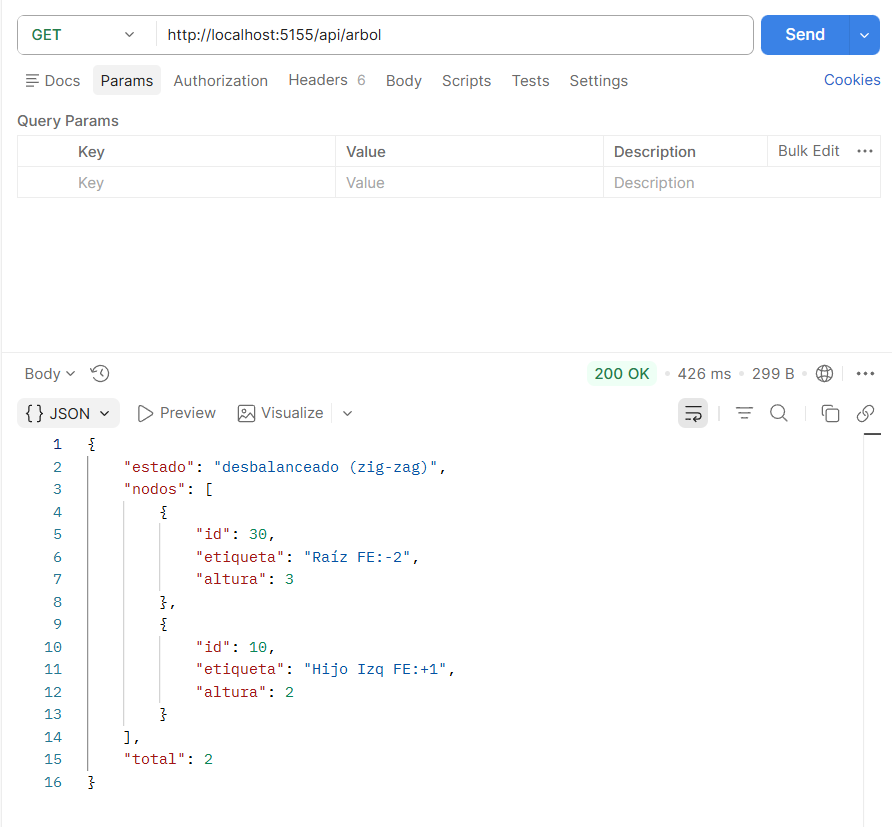
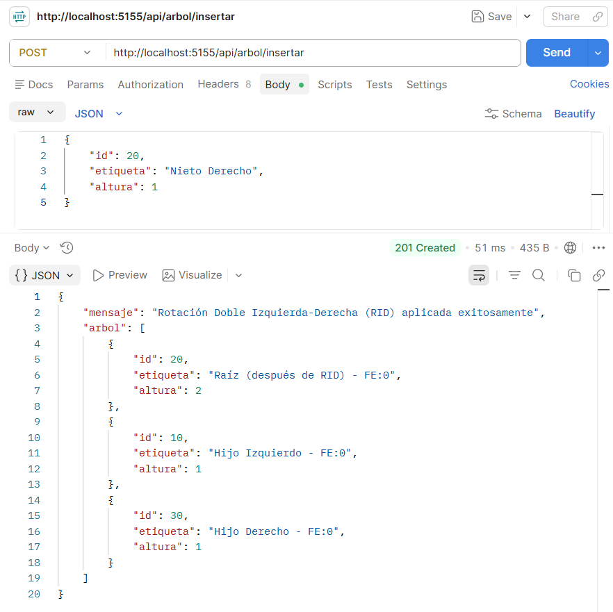
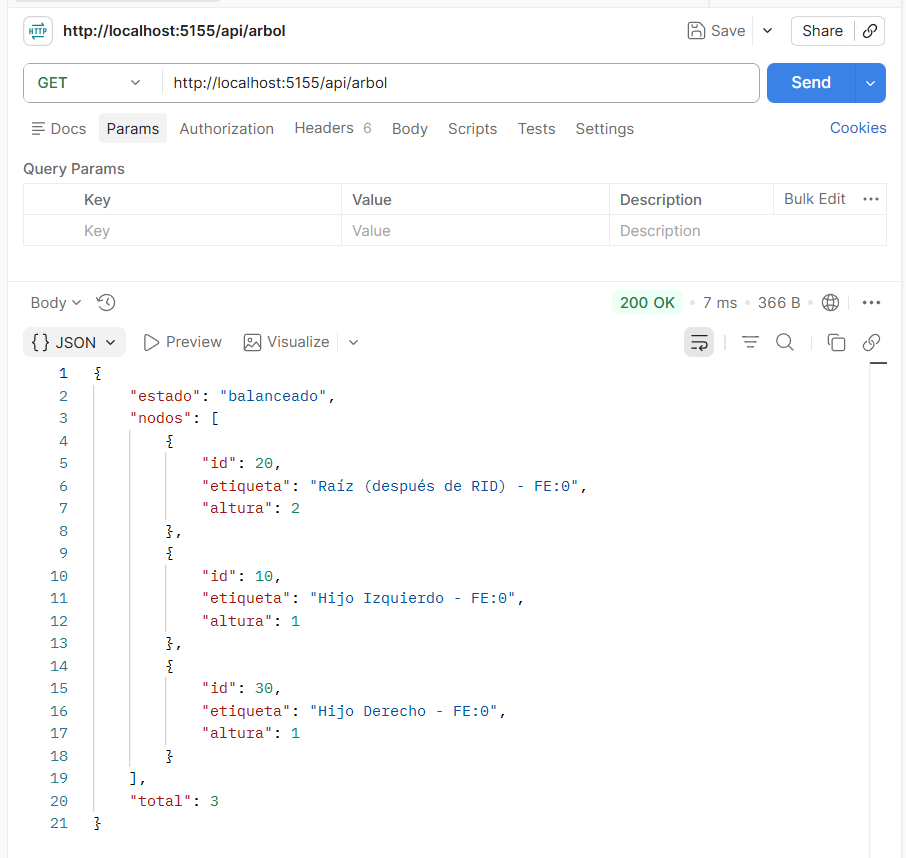
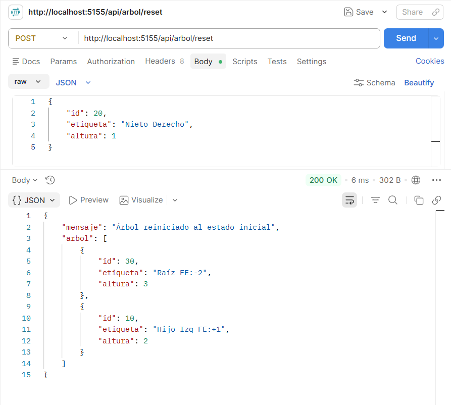
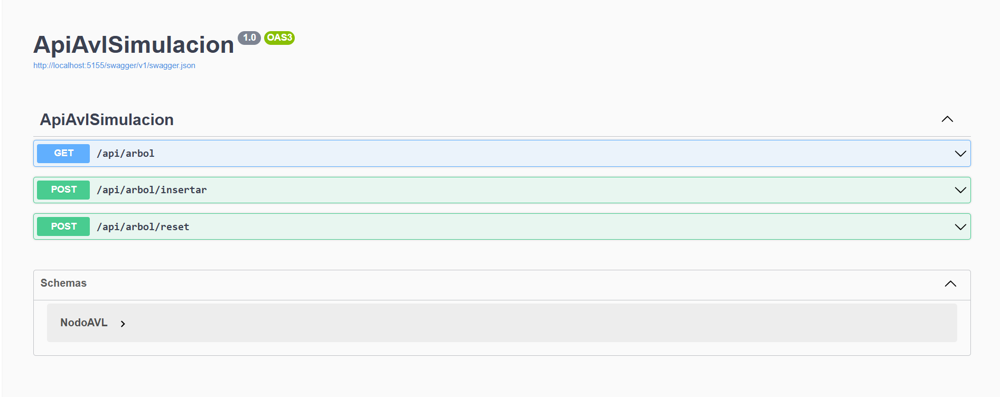

## Parte 1: Investigación Teórica y Análisis de Casos

### 1. El Límite de las Rotaciones Simples y Desbalanceo en "Zig-Zag"

#### • El Problema Cruzado

Cuando se insertan valores en secuencia cruzada como `30, 10, 20`, ocurre un desbalance en forma de "zig-zag". Las rotaciones simples fallan porque:

- Una **rotación simple a la derecha (RDD)** sobre el nodo 30 solo cambia la inclinación, resultando en un árbol aún desbalanceado hacia el otro lado.
    
- Una **rotación simple a la izquierda (RLL)** no es aplicable directamente.
    

El problema fundamental es que el Factor de Equilibrio (FE) del nodo padre y su hijo tienen **signos opuestos**, indicando que el desbalance no está alineado.

**Condiciones matemáticas para una Rotación Doble Izquierda-Derecha (RID):**

|Nodo|Condición de FE|
|---|---|
|**Nodo Abuelo (A)**|`FE(A) = -2` (desbalanceado hacia la izquierda)|
|**Nodo Padre (B)**|`FE(B) = +1` (inclinado hacia la derecha)|

    

#### • Principio DRY (Don't Repeat Yourself)

**Ventaja de ingeniería de software:**

Implementar rotaciones compuestas (RID y RDI) reutilizando primitivas de rotación simple ofrece:

1. **Reducción de código duplicado**: Las operaciones de reasignación de punteros se escriben una sola vez.
    
2. **Menor probabilidad de errores**: Al reutilizar código probado, se evitan bugs por manipulación incorrecta de referencias.
    
3. **Mantenibilidad**: Si se descubre un error en la lógica de rotación simple, se corrige en un solo lugar.
    
4. **Legibilidad**: El código expresa la intención claramente:
    
5. **Composición clara**: La rotación doble se lee como "rotación izquierda sobre el hijo, luego rotación derecha sobre el padre".
    

---

### 2. Fundamentos de Arquitectura Web y Protocolo HTTP

#### • El Modelo Cliente-Servidor

**Componentes que interactúan:**

text

Cliente (Postman/Navegador)  ↔  Servidor Web (ASP.NET Core)  ↔  Recurso (API endpoint)

**Flujo de datos en una Petición (Request):**

|Componente|Descripción|Ejemplo|
|---|---|---|
|**Método HTTP**|Acción deseada|`GET`, `POST`|
|**URL/URI**|Identifica el recurso|`/api/arbol`|
|**Headers**|Metadatos de la petición|`Content-Type: application/json`|
|**Body**|Datos enviados (opcional)|`{"id": 20}`|

**Flujo de datos en una Respuesta (Response):**

|Componente|Descripción|Ejemplo|
|---|---|---|
|**Código de estado**|Resultado de la operación|`200 OK`, `201 Created`|
|**Headers**|Metadatos de la respuesta|`Content-Type: application/json`|
|**Body**|Datos devueltos|Lista de nodos del árbol|

#### • Semántica de Operaciones

| Característica          | **GET**                               | **POST**                                      |
| ----------------------- | ------------------------------------- | --------------------------------------------- |
| **Propósito**           | Recuperar/leer datos                  | Enviar datos para crear/modificar             |
| **Idempotencia**        | Sí (misma petición = mismo resultado) | No (múltiples POSTs crean múltiples recursos) |
| **Body**                | No debe tener body                    | Puede tener body con datos                    |
| **Uso en el ejercicio** | Recuperar estructura del árbol        | Insertar nuevos nodos                         |
| **Cacheable**           | Sí                                    | No por defecto                                |
| **Seguridad**           | No modifica recursos                  | Modifica estado del servidor                  |

**Conclusión para la actividad:**

- **GET** → Para **recuperar** la estructura del árbol (operación segura y cacheable)
    
- **POST** → Para **mutar/insertar** nuevos elementos (operación no idempotente que modifica el estado)

## Parte 2: Implementación Práctica - API de Simulación AVL

