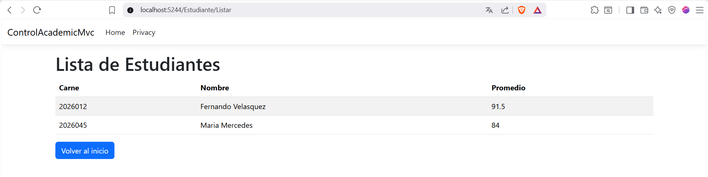
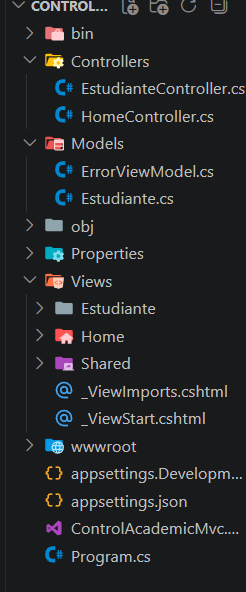
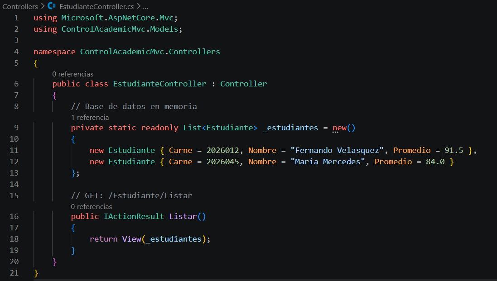
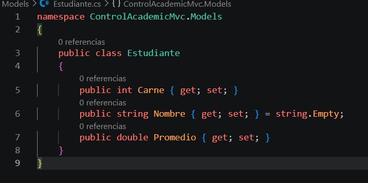
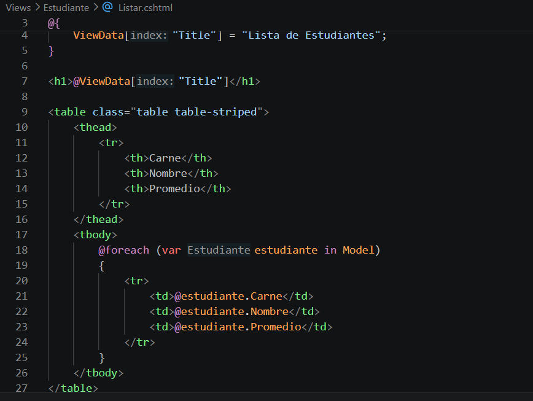

#### Nombre: Wagner Maximiliano Ley Monroy
#### Carnet: 202502811
## Parte 1: Fundamentación Teórica y Análisis Crítico

### 1. El Tránsito hacia los Sistemas Distribuidos y Multi-Capa

#### La Limitación del Monolito Local

Cuando la interfaz, la lógica y el almacenamiento residen exclusivamente en una máquina física aislada, se presentan los siguientes problemas críticos:

- **Sincronización**: Cada instancia del sistema opera sobre su propio conjunto de datos, provocando inconsistencias cuando múltiples usuarios interactúan simultáneamente. Los datos se vuelven "islas de información" sin coordinación central.
    
- **Escalabilidad**: El sistema está limitado por los recursos físicos de una sola máquina (RAM, CPU, almacenamiento). Para escalar, se requiere migrar a hardware más potente (escalado vertical), lo cual tiene un costo exponencial y un límite físico.
    
- **Disponibilidad**: Un fallo en la máquina anula completamente la operación del sistema (punto único de falla).
    
- **Mantenimiento**: Actualizar cualquier componente requiere detener todo el sistema, afectando la disponibilidad del servicio.
    

#### Distinción Crítica (Layers vs. Tiers)

|**Capas Lógicas (Layers)**|**Niveles Físicos (Tiers)**|
|---|---|
|Organización conceptual del código dentro del software|Distribución física de los componentes en hardware separado|
|Separación de responsabilidades en el diseño|Separación de ejecución en infraestructura|
|Pueden coexistir en un mismo proceso/aplicación|Cada tier corre en su propio servidor/máquina|
|Ejemplo: Modelo, Vista, Controlador|Ejemplo: Servidor web, Servidor de aplicaciones, Servidor de BD|
|Enfoque en la mantenibilidad del código|Enfoque en la escalabilidad, seguridad y rendimiento|

> **Caso práctico**: Una aplicación MVC puede tener todas sus capas (Modelo, Vista, Controlador) en una sola máquina física (1-Tier), mientras que una arquitectura N-Tier distribuye la capa de presentación en servidores web, la capa de negocio en servidores de aplicaciones y la capa de datos en servidores de base de datos separados.

#### Responsabilidades en la Arquitectura de 3 Niveles

**Nivel 1: Capa de Presentación (Presentation Tier)**

- **Misión exclusiva**: Gestionar la interacción con el usuario, mostrando interfaces y capturando entradas, sin contener lógica de negocio.
    
- **Tecnologías comunes**: HTML, CSS, JavaScript, Razor Pages ([ASP.NET](https://asp.net/) Core), React, Angular, Vue.js, aplicaciones móviles.
    

**Nivel 2: Capa de Aplicación o Negocio (Application Tier)**

- **Misión exclusiva**: Contener y ejecutar la lógica de negocio, reglas de validación, cálculos, flujos de trabajo y orquestación de procesos.
    
- **Tecnologías comunes**: [ASP.NET](https://asp.net/) Core MVC, Web API, Spring Boot, Node.js, Python Django, servicios REST/SOAP.
    

**Nivel 3: Capa de Datos (Data Tier)**

- **Misión exclusiva**: Almacenar, recuperar y gestionar datos persistentes de manera segura y eficiente, proporcionando integridad y consistencia.
    
- **Tecnologías comunes**: SQL Server, PostgreSQL, MySQL, Oracle, MongoDB, servicios de almacenamiento en la nube.
    

#### Seguridad Perimetral

**Error crítico**: Exponer directamente el puerto de una base de datos (ej. 5432 para PostgreSQL, 3306 para MySQL, 1433 para SQL Server) a Internet.

**Razones técnicas**:

1. **Superficie de ataque ampliada**: Los atacantes pueden ejecutar ataques de fuerza bruta, inyección SQL, explotación de vulnerabilidades conocidas del motor de base de datos.
    
2. **Autenticación débil**: Muchas bases de datos tienen configuraciones de autenticación menos robustas que los sistemas de aplicaciones.
    
3. **Exposición de datos sensibles**: Una brecha permite el acceso directo a datos críticos sin pasar por las capas de validación y auditoría de la aplicación.
    

**Buena práctica recomendada**:

- Colocar la base de datos en una red privada (VPC/Subred privada) sin IP pública.
    
- Configurar grupos de seguridad/firewalls para permitir tráfico **solo** desde los servidores de aplicaciones autorizados.
    
- Utilizar una VPN o conexión privada (ej. AWS PrivateLink, Azure Private Endpoint) para acceso administrativo.
    
- Implementar un **bastión/jump host** con acceso restringido para tareas de administración de base de datos.
    

### 2. Desacoplamiento Lógico con el Patrón MVC

#### La Crisis del Código Espagueti

**Impactos negativos** de mezclar SQL, lógica matemática y etiquetas visuales en un mismo archivo:

- **Mantenimiento deficiente**: Un cambio en la interfaz puede romper consultas SQL; un cambio en la lógica de negocio puede afectar la presentación.
    
- **Pruebas unitarias imposibles**: No se puede aislar la lógica de negocio para probarla sin la interfaz gráfica o sin la base de datos real.
    
- **Dificultad para depurar**: El rastreo de errores se vuelve complejo al estar los componentes entrelazados.
    
- **Baja reutilización**: El código no puede ser reutilizado en otros contextos porque está acoplado a aspectos específicos (ej. UI específica, BD específica).
    
- **Dificultad para escalar equipos**: Varios desarrolladores no pueden trabajar en paralelo en el mismo archivo sin conflictos constantes.
    

#### Separación de Preocupaciones (SoC) - Componentes MVC

**Modelo**:

- **Representación**: La estructura de datos, la lógica de negocio, las reglas de validación y el estado de la aplicación.
    
- **No debe conocer** cómo se muestran los datos porque eso es responsabilidad de la Vista. El Modelo es completamente independiente de la interfaz de usuario y del mecanismo de presentación.
    
- Contiene la "inteligencia" de dominio de la aplicación.
    

**Vista**:

- Definida como una **entidad pasiva pero inteligente**:
    
    - **Pasiva**: No contiene lógica de negocio ni toma decisiones sobre datos; solo recibe datos y los presenta.
        
    - **Inteligente**: Es capaz de aplicar lógica de presentación (formateo, condicionales de visualización, iteración) para renderizar la interfaz de manera dinámica.
        
- **Código prohibido**: Lógica de negocio, acceso a base de datos, manipulación directa de datos del Modelo, operaciones que modifiquen el estado de la aplicación.
    

**Controlador**:

- **Rol táctico**: Intermediario que recibe las peticiones del usuario, interpreta las acciones, coordina las operaciones con el Modelo y selecciona la Vista apropiada.
    
- **Director de orquesta**: No realiza operaciones complejas por sí mismo, sino que **orquesta** las interacciones entre los componentes.
    
- Características: Delgado (skinny), sin lógica de negocio, sin acceso directo a la base de datos.
    

#### Métricas de Ingeniería de Software

**Alta Cohesión** con MVC:

- Cada componente tiene una única responsabilidad bien definida.
    
- El Modelo se enfoca solo en datos y reglas de negocio.
    
- La Vista se enfoca solo en la presentación.
    
- El Controlador se enfoca solo en la orquestación de peticiones.
    

**Bajo Acoplamiento** con MVC:

- El Modelo no conoce la Vista ni el Controlador.
    
- La Vista no conoce el Modelo directamente (recibe datos a través del Controlador).
    
- El Controlador conoce el Modelo pero no la Vista directamente (usa un motor de plantillas).
    
- Se pueden cambiar componentes de forma independiente:
    
    - Cambiar la Vista (ej. de Razor a React) sin afectar el Modelo o Controlador.
        
    - Cambiar el Modelo (ej. de SQL Server a MongoDB) sin afectar la Vista.
        

---

## Parte 2: Modelado del Ciclo de Vida y Enrutamiento Semántico

### 1. Mapeo Analítico de URLs

Plantilla: `{controller=Home}/{action=Index}/{id?}`

|**URL Entrante del Cliente**|**Clase Controladora Buscada**|**Método (Acción) Ejecutado**|**Parámetro id Inyectado**|
|---|---|---|---|
|[https://ingenieria.usac.edu.gt/ControlAcademico/Login](https://ingenieria.usac.edu.gt/ControlAcademico/Login)|ControlAcademicoController|Login|null (No especificado)|
|[https://ingenieria.usac.edu.gt/Estudiante/Historial/20260123](https://ingenieria.usac.edu.gt/Estudiante/Historial/20260123)|EstudianteController|Historial|"20260123"|
|[https://ingenieria.usac.edu.gt/Asignacion/Detalle/10](https://ingenieria.usac.edu.gt/Asignacion/Detalle/10)|AsignacionController|Detalle|"10"|
|[https://ingenieria.usac.edu.gt/Home](https://ingenieria.usac.edu.gt/Home)|HomeController|Index|null (No especificado)|
|[https://ingenieria.usac.edu.gt/](https://ingenieria.usac.edu.gt/)|HomeController|Index|null (Sin segmentos)|

### 2. Diagramación del Flujo Interactivo

**Viaje completo de una petición HTTP (pasos 1 al 5):**

|**Paso**|**Componente**|**Descripción**|
|---|---|---|
|**1**|**Navegador (Cliente)**|El usuario hace clic en un botón o escribe una URL. El navegador construye una petición HTTP (GET o POST) y la envía al servidor web.|
|**2**|**Servidor Web / Middleware ([ASP.NET](https://asp.net/) Core)**|El servidor recibe la petición, el middleware procesa la ruta (enrutamiento) y determina qué Controlador y Acción deben manejar la solicitud según la plantilla configurada (ej. `{controller}/{action}/{id?}`).|
|**3**|**Controlador**|La instancia del Controlador recibe la petición. **No procesa datos directamente**, sino que: (a) valida parámetros de entrada (validación perimetral), (b) invoca operaciones del Modelo (si es necesario), (c) prepara datos para la Vista (ViewData, ViewBag, o Model).|
|**4**|**Modelo**|Si la operación lo requiere (ej. consulta, inserción, actualización), el Controlador solicita datos al Modelo. El Modelo ejecuta la lógica de negocio o accede a la base de datos (Tier 3), retorna los datos procesados al Controlador.|
|**5**|**Vista + Respuesta**|El Controlador selecciona la Vista adecuada y le pasa los datos (Model). El motor de vistas (Razor) procesa la plantilla, genera HTML dinámico y lo envía de vuelta al navegador como respuesta HTTP. El navegador renderiza el HTML para el usuario.|

> **Nota**: En arquitecturas modernas, el Modelo puede residir en un Tier separado (servidor de aplicaciones o API), y el Controlador se comunica con él mediante HTTP o RPC.

# Parte 3: Implementación Práctica - Sistema de Control Académico

### Estructura del proyecto:

## Parte 4: Auditoría y Control de Calidad

### 1. Prueba de Cohesión (GET)

**URL de prueba**: `http://localhost:5000/Estudiante/Listar`

**Resultado esperado**:

- Respuesta limpia (HTML renderizado con la lista de estudiantes).
    
- El controlador no contiene cálculo interno ni sentencias SQL.
    
- Solo despacha información desde la fuente de datos simulada hacia la vista.
    

**Validación de principios**:

-  El Controlador no realiza operaciones matemáticas.
    
-  El Controlador no contiene SQL en texto plano.
    
-  El Controlador solo extrae datos del modelo y los inyecta en la vista.
    

### 2. Evaluación de Antipatrones

**Análisis de `EstudianteController.cs`**:

| **Método**  | **Líneas de código** | **¿Excede 20 líneas?** | **Estado** |
| ----------- | -------------------- | ---------------------- | ---------- |
| `Listar`    | 3 líneas             | No                     | Aceptable  |
| `Registrar` | 7 líneas             | No                     | Aceptable  |

**Conclusión**: El controlador cumple con el principio de **Skinny Controllers**. Todas las operaciones complejas (como validaciones avanzadas, lógica de negocio y acceso a datos) deben ser delegadas a servicios específicos (capa de servicios) en versiones posteriores.

---

## Parte 5: Referencias Bibliográficas

### Referencias Centrales

> Facultad de Ingeniería, USAC. (2026). **Sesión 11: Modelado Base y Arquitecturas de Despliegue. Evolución de Sistemas Distribuidos, Fundamentos del Modelo Cliente-Servidor y Diseño Físico Multi-Capas (N-Tier)**. Laboratorio del curso Introducción a la Programación y Computación 2. Guatemala.

> Facultad de Ingeniería, USAC. (2026). **Sesión 12: Arquitectura y Componentes del Patrón MVC. Desacoplamiento Lógico de Software, Ciclo de Vida de las Peticiones y Enrutamiento en Aplicaciones Interactivas Modernas**. Laboratorio del curso Introducción a la Programación y Computación 2. Guatemala.
